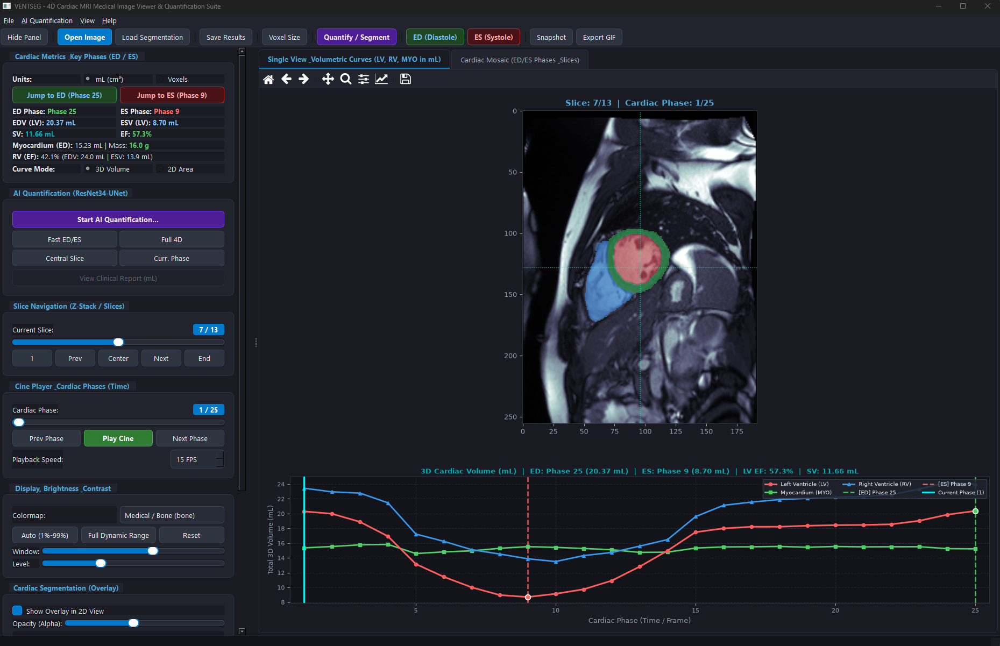

<div align="center">
  
  <h1>VENTSEG 4D</h1>
  <h3>Cardiac Medical Image Viewer & AI Quantification Suite</h3>
  <p>
    <b>Interactive 4D Cine Cardiac MRI Workstation • Deep Learning Multi-Class Segmentation • Manual Correction & Topology Editor • Quantitative Functional Biomarkers</b>
  </p>

  [](https://www.python.org/)
  [](https://riverbankcomputing.com/software/pyqt/)
  [](https://pytorch.org/)
  [](https://opensource.org/licenses/Apache-2.0)
  [](https://www.uv.cl/)
  [](#ai-assisted-interface-engineering)
</div>

---

<div align="center">
  
  <p><em>Figure 1: Main graphical user interface of VENTSEG 4D featuring interactive 4D cine playback, real-time slice scrolling, multi-class segmentation overlays (Left Ventricle, Myocardium, Right Ventricle), synchronized volumetric curves in milliliters (mL), and comprehensive cardiac quantification metrics.</em></p>
</div>

---

## Table of Contents
- [Overview](#overview)
- [Key Features](#key-features)
- [Interactive Manual Segmentation Correction & Topology Editor](#interactive-manual-segmentation-correction--topology-editor)
- [Keyboard Shortcuts & Quick Navigation](#keyboard-shortcuts--quick-navigation)
- [System Requirements](#system-requirements)
- [Installation & Portable Setup](#installation--portable-setup)
- [Download Models (Pre-trained Weights)](#download-models-pre-trained-weights)
- [Download Sample Input Data](#download-sample-input-data)
- [How to Run](#how-to-run)
- [Project Directory Structure](#project-directory-structure)
- [Cardiac Metrics & AI Models](#cardiac-metrics--ai-models)
- [Supported Formats & Export Capabilities](#supported-formats--export-capabilities)
- [Research Purpose & Disclaimer](#research-purpose--disclaimer)
- [Academic Origin & Acknowledgments](#academic-origin--acknowledgments)
- [Funding & Research Grants](#funding--research-grants)
- [AI-Assisted Interface Engineering](#ai-assisted-interface-engineering)
- [Troubleshooting & FAQ](#troubleshooting--faq)
- [License](#license)

---

## Overview

**VENTSEG 4D** was developed exclusively for **research and academic purposes** to transfer and share with the scientific and medical imaging community a deep learning model developed for cardiac ventricular segmentation. It offers high-performance 4D (3D spatial + time) cine MRI exploration along with an embedded deep learning architecture (**ResNet34-UNet**) capable of segmenting:
1. **Left Ventricular Cavity (LV)** - Class 1 (Red)
2. **Myocardium (MYO)** - Class 2 (Green)
3. **Right Ventricular Cavity (RV)** - Class 3 (Blue)

The suite automates the identification of **End-Diastole (ED)** and **End-Systole (ES)** cardiac phases, computes volumetric time-series curves, calculates functional biomarkers (ejection fraction **EF %**, stroke volume **SV**, and myocardial mass), and provides an interactive **Manual Segmentation Correction & Topology Editor** with real-time biomarker recalculation.

---

## Key Features

- **High-Performance 4D Cine Playback**: Smooth time-series cine loop playback with adjustable framerate (FPS), scrub bars, play/pause controls, and slice indexing.
- **Multi-View Modes**:
  - **Single Slice View & Volumetric Curves**: High-detail slice inspection with overlay masks, interactive zoom/pan, and synchronized volume curves in milliliters (mL).
  - **Cardiac Mosaic Grid**: Simultaneous multi-phase comparison (ED vs ES) and full spatial coverage across all Z-slices.
  - **Segmentation Correction (Manual Refinement)**: Interactive drawing and topology editing workstation tab.
- **Automated AI Segmentation**: In-memory deep learning inference utilizing pre-trained weights (`models/model_resnet34_unet_scratch_best_dice.pt`). Supports CPU and NVIDIA CUDA GPU execution.
- **Interactive Manual Segmentation Correction**: Full suite of manual refinement tools (Brush, Eraser, Flood Fill, Morphological filters, Undo/Redo, Slice Copy) with live quantitative recalculation.
- **Automated Cardiac Phase Detection**: Automatic extraction of peak expansion (ED) and peak contraction (ES) from time-series volume curves.
- **Quantitative Cardiac Biomarkers Calculation**:
  - Left & Right Ventricle Ejection Fraction (LV EF %, RV EF %)
  - Stroke Volume (SV in mL)
  - End-Diastolic Volume (EDV in mL) & End-Systolic Volume (ESV in mL)
  - Myocardial Mass (in grams, using standard myocardial density of 1.05 g/cm³)
- **Export & Reporting Options**:
  - Segmented 4D Dataset (`.mat`) and companion ED/ES masks
  - Formatted Quantification Summary Report (`.txt`)
  - Volumetric Time-Series Curves (`.csv`)
  - High-Resolution Viewport Figures (`.png`, `.jpg`)
  - Animated Cine-loops (`.gif`)

---

## Interactive Manual Segmentation Correction & Topology Editor

VENTSEG 4D features a dedicated **Manual Segmentation Correction & Topology Editor** (accessible via **Tab 3**, shortcut `Ctrl + T`, or toolbar button **"Correct Mask"**). This workstation allows researchers and imaging specialists to manually edit, refine, or delineate multi-class ventricular masks on any slice and cardiac phase.

<div align="center">
  
</div>

### 1. Multi-Class Anatomical Structure Selection
Select the target anatomical compartment using dedicated radio buttons:
- **LV Cavity / Endocardium (Label 1 - Red)**: Left ventricular blood pool.
- **LV Myocardium (Label 2 - Green)**: Myocardial muscle wall.
- **RV Cavity (Label 3 - Blue)**: Right ventricular blood pool.
- **Background / Eraser (Label 0)**: Void / non-cardiac tissue.

### 2. Interactive Tool Modes
- **Brush (Paint)**: Continuous freehand drawing with anti-gap stroke interpolation.
- **Eraser**: Precise carving and removal of segmented voxels.
  > [!TIP]
  > **Quick Eraser Shortcut**: Clicking with the **Right Mouse Button** activates the eraser instantly at any time, regardless of the currently selected tool.
- **Bucket Fill (Flood Fill)**: Fast connected-component region filling (`scipy.ndimage.label`) for entire cavity chambers or background regions in a single click.

### 3. Smart Cardiac Topology Engine
When **Smart Cardiac Topology** is active (enabled by default):
- **Clean Structure Overwriting**: Painting a new label cleanly replaces overlapping classes without invalid label collisions.
- **LV Cavity Carving & Auto-Myocardial Expansion**: Erasing pixels from the internal LV cavity boundary automatically causes the adjacent Myocardium (Class 2) to expand and seal the carved border, maintaining anatomical wall continuity.
- **Dual-Wall Myocardial Trimming**:
  - Erasing the *inner* myocardial wall (closer to the LV lumen) automatically expands the LV cavity (Class 1).
  - Erasing the *outer* myocardial wall (closer to the background) trims the mask to background (Class 0).

### 4. Morphological & Correction Utilities
- **Fill Holes (`Fill Holes`)**: Automatically closes and fills all internal lacunae/holes within the selected class or across all classes (`scipy.ndimage.binary_fill_holes`).
- **Clean Islands (`Clean Islands`)**: Applies connected-component labeling (`scipy.ndimage.label`) to eliminate disconnected spurious noise specks, retaining only the primary anatomical structure.
- **Smooth Contours (`Smooth`)**: Applies morphological binary opening and closing filters to regularize contour boundaries and remove pixelated artifacts.
- **Multi-Slice Mask Propagation (`Copy ◀ Slice` / `Copy Slice ▶`)**: Copies the complete segmentation mask from adjacent Z-slices (previous or next) to the current slice, accelerating multi-slice contouring.
- **Clear Slice Mask**: Wipes the mask on the active slice to start fresh.
- **Revert Slice**: Restores the active slice mask to its state before current editing session.

### 5. Brush Configuration & Visual Feedback
- **Brush Radius Slider & SpinBox**: Adjustable brush radius from `1 px` to `40 px`.
- **Brush Shape**: Choose between **Circle** (isotropic) and **Square** brush geometries.
- **Mask Opacity**: Interactive transparency slider ($10\%$ to $100\%$) for clear visualization of underlying myocardium textures.
- **Live Animated Cursor**: Responsive dashed circular/square reticle reflecting the exact brush diameter and active mode color (`Cyan` for paint, `Coral` for eraser).
- **Voxel Inspector Status Bar**: Live display of cursor coordinates `[Row, Col]`, grayscale image intensity, and current voxel mask label.

### 6. Deep Undo / Redo Architecture
- Integrated **40-level deep history stack** (`Ctrl + Z` to Undo, `Ctrl + Y` to Redo) per slice session, ensuring safe and reversible manual editing.

### 7. Live Quantitative Clinical Biomarker Recalculation
Every brush stroke, morphological operation, or slice propagation instantly triggers:
- **Active 2D Slice Area**: Real-time display of area in $\text{cm}^2$ and pixel counts for LV, MYO, and RV based on physical voxel calibration.
- **Global 3D/4D Clinical Parameters**: Instant recomputation of End-Diastolic Volume (**EDV** in mL), End-Systolic Volume (**ESV** in mL), Stroke Volume (**SV** in mL), Ejection Fraction (**EF %**), and Myocardial Mass (in grams). All updated parameters are synchronized in real time with the main volumetric curves.

### 8. Saving & Exporting Corrected Masks
- **Save Corrected Mask (.mat)**: Saves the complete 4D matrix `segmentation_all_phases.mat` along with physical `voxel_size`, `ed_phase`, and `es_phase` metadata. It also automatically exports synchronized companion files `segmentation_ED.mat` and `segmentation_ES.mat`.
- **Export Slice Snapshot (PNG / JPG)**: Exports high-resolution, publication-ready snapshots of the corrected slice with medical colormaps and segmentation overlays.

---

## Keyboard Shortcuts & Quick Navigation

| Shortcut | Action |
| :--- | :--- |
| **Ctrl + O** | Open 4D medical imaging dataset (`.mat`, `.nii`, `.npy`) |
| **Ctrl + M** | Load companion segmentation mask (`.mat`, `.nii`) |
| **Ctrl + R** | AI Cardiac Quantification & Deep Learning Segmentation (ResNet34-UNet) |
| **Ctrl + T** | Open **Manual Segmentation Correction & Topology Editor** (Tab 3) |
| **Ctrl + K** | Open Spatial Calibration & Physical Voxel Size dialog ($dx, dy, dz$ in mm) |
| **Ctrl + Shift + S** | Save all results (MAT masks, clinical TXT report, CSV curves, figures, GIF) |
| **Ctrl + S** | Export current viewport snapshot as high-resolution PNG |
| **Ctrl + G** | Export animated cardiac cine-loop as GIF |
| **Ctrl + B** | Toggle Sidebar control panel (Hide / Show) |
| **Ctrl + Z** | **Undo** last brush stroke / manual edit |
| **Ctrl + Y** | **Redo** previously undone action |
| **Space** | Play / Pause 4D Cine playback |
| **Left / Right Arrow** | Previous / Next cardiac phase |
| **Up / Down Arrow** | Next / Previous spatial Z-slice |
| **Mouse Scroll Wheel** | Scroll through spatial Z-slices on drawing canvas |
| **Right Mouse Click** | Quick Eraser (active drawing canvas) |
| **E** | Jump to End-Diastole phase (**ED**) |
| **S** | Jump to End-Systole phase (**ES**) |
| **U** | Toggle volume display units (**mL** $\leftrightarrow$ **Voxels**) |
| **M** | Toggle segmentation mask overlay visibility |
| **R** | Reset brightness and contrast (Window/Level) |
| **Ctrl + Q** | Exit application |

---

## System Requirements

- **Operating System**: Windows 10/11 (64-bit), Linux (x86_64), or macOS.
- **Python Version**: Python 3.10, 3.11, or 3.12 (**Python 3.12 64-bit recommended**).
- **Hardware**:
  - Minimum 8 GB RAM (16 GB recommended for large 4D volumes).
  - CPU (Intel/AMD) or NVIDIA GPU with CUDA support for accelerated AI segmentation.

---

## Installation & Portable Setup

If you copy or move this application folder to another machine or directory, you can set it up and run it immediately:

### 1. Create a Virtual Environment

Open a terminal in the application folder:

**Windows (PowerShell / Command Prompt):**
```powershell
py -3.12 -m venv .venv
```

**Linux / macOS:**
```bash
python3.12 -m venv .venv
```

### 2. Activate the Virtual Environment

**Windows PowerShell:**
```powershell
.\.venv\Scripts\Activate.ps1
```
*(If script execution is blocked on PowerShell, run `Set-ExecutionPolicy -Scope Process -ExecutionPolicy Bypass` first).*

**Windows CMD:**
```cmd
.\.venv\Scripts\activate.bat
```

**Linux / macOS:**
```bash
source .venv/bin/activate
```

### 3. Install Requirements

```bash
pip install -r requirements.txt
```

All standard dependencies (`PyQt6`, `albumentations`, `opencv-python`, `nibabel`, `numpy`, `scipy`, `matplotlib`, `imageio`, `Pillow`) and base PyTorch will be installed.

### 4. Enable NVIDIA GPU Acceleration (Recommended)

By default, `pip install -r requirements.txt` installs the CPU build of PyTorch. If your system has an NVIDIA dedicated graphics card, enable hardware-accelerated segmentation by running the appropriate command:

#### A. Standard NVIDIA GPUs (RTX 20xx, 30xx, 40xx, GTX 16xx, Quadro, Tesla, A100):
```bash
pip install --force-reinstall torch torchvision --index-url https://download.pytorch.org/whl/cu124
```

#### B. Latest-Generation NVIDIA GPUs (Blackwell Architecture `sm_120`, RTX 50xx, RTX PRO Blackwell):
Latest-generation NVIDIA GPUs built on the **Blackwell** architecture require CUDA 12.8+ binaries to supply native `sm_120` compute kernels:
```bash
pip install --upgrade --pre torch torchvision --index-url https://download.pytorch.org/whl/nightly/cu128
```

> [!TIP]
> To verify that Python and PyTorch recognize your GPU, run:
> ```bash
> python -c "import torch; print('CUDA Available:', torch.cuda.is_available()); print('GPU Device:', torch.cuda.get_device_name(0) if torch.cuda.is_available() else 'CPU')"
> ```

---

## Download Models (Pre-trained Weights)

Due to GitHub's file size limit (files > 100 MB cannot be hosted directly in the repository), the pre-trained neural network weights (`model_resnet34_unet_scratch_best_dice.pt`, ~143 MB) and model architecture files are hosted on Google Drive:

📥 **[Download Models Folder (Google Drive)](https://drive.google.com/drive/folders/1wZ_0Di2xuCjZOw6atymoHlt45K8AJHeV?usp=sharing)**

### Setup Steps:
1. Open the [Google Drive link](https://drive.google.com/drive/folders/1wZ_0Di2xuCjZOw6atymoHlt45K8AJHeV?usp=sharing).
2. Download the `models` folder or its files (`__init__.py`, `resnet.py`, and `model_resnet34_unet_scratch_best_dice.pt`).
3. Place the `models/` folder directly in the root directory of this project:
   ```text
   ventseg/
   └── models/
       ├── __init__.py
       ├── resnet.py
       └── model_resnet34_unet_scratch_best_dice.pt
   ```

---

## Download Sample Input Data

An example input dataset is available on Google Drive for testing and demonstration purposes:

📁 **[Download Sample Input Data (Google Drive)](https://drive.google.com/drive/folders/1bKaooRMNtSt7z_AWuwHUdUfG1jtCdl1k?usp=sharing)**

> [!WARNING]
> **Important Note on Voxel Size Calibration (`data_SA.voxel_MR`):**
> 
> The `data_SA.mat` file contains the standardized `data_SA` structure used across applications:
> - `data_SA.MR_SA`: 4D Short-Axis cine cardiac MRI matrix ($Rows \times Cols \times Slices \times Phases$).
> - `data_SA.voxel_MR`: Physical spatial voxel dimensions $[dx; dy; dz]$ in millimeters (e.g., $[0.703; 0.703; 10.0]$ mm).
> 
> To obtain accurate volumetric measurements (in mL) and clinical biomarkers, ensure that `data_SA.voxel_MR` reflects the true physical voxel spacing from your original DICOM acquisition (`Pixel Spacing` $[dx, dy]$ and `Slice Thickness` / `Spacing Between Slices` $[dz]$ in millimeters).
> 
> You can update or calibrate the voxel size using either of the following methods:
> 
> 1. **Directly from the VENTSEG 4D Graphical Interface:**
>    - Open `data_SA.mat` in the application.
>    - Press `Ctrl + K` or click **Spatial Calibration / Voxel Size (mm)...** in the top menu or the sidebar.
>    - Enter the true physical dimensions $[dx, dy, dz]$ in millimeters (e.g., `0.70, 0.70, 10.0`) and click **Apply Calibration**. The application will automatically update and recompute all quantitative volume curves and metrics in real time.
> 
> 2. **Directly in MATLAB (`data_SA.mat`):**
>    - Define or edit the `data_SA` structure in MATLAB / Python:
>      ```matlab
>      % Example in MATLAB (data_SA structure):
>      data_SA.MR_SA = MR_SA_4D;        % 4D cine Short-Axis MRI (Rows x Cols x Slices x Phases)
>      data_SA.voxel_MR = [dx; dy; dz]; % Voxel dimensions in mm (e.g. [0.703125; 0.703125; 10.0])
>      save('data_SA.mat', 'data_SA', '-v7.3');
>      ```

---

## How to Run

### Interactive GUI Mode
With the virtual environment activated, run:
```bash
python viewer_4d.py
```
Then use **File > Open Image...** to load a dataset (e.g. `data_SA.mat`).

### Direct Dataset Loading
You can pass the path of a `data_SA.mat` or `.nii` file directly as a command-line argument:
```bash
python viewer_4d.py path/to/data_SA.mat
```

---

## Project Directory Structure

```text
ventseg/
├── viewer_4d.py                 # Main PyQt6 GUI, 4D workstation & correction editor
├── requirements.txt             # Python dependencies
├── README.md                    # Detailed documentation and user guide
├── readme.txt                   # Plaintext quick-start reference
├── images/
│   ├── Logo.png                 # Application logo (PNG)
│   ├── Logo.ico                 # Multi-resolution application icon (ICO)
│   └── Main_Windows.png         # Main application interface preview
├── models/                      # Downloaded from Google Drive
│   ├── __init__.py              # Model selector and package interface
│   ├── resnet.py                # ResNet34-UNet architecture definitions
│   └── model_resnet34_unet_scratch_best_dice.pt  # Pre-trained AI weights (~143 MB)
└── utils/
    ├── __init__.py              # Utilities package interface
    ├── data_augmentation.py     # Pre-processing and test-time augmentation
    ├── dataload.py              # Medical image loader and normalizer
    └── training.py              # Multiclass mask handling and reshaping
```

---

## Cardiac Metrics & AI Models

The application performs automated segmentation using a 2D ResNet34-UNet model evaluated slice-by-slice across 3D spatial slices ($Z$) and cardiac temporal frames ($T$).

### Metric Formulations:
- **Stroke Volume (SV)**:
  $$\text{SV} = \text{EDV} - \text{ESV}$$
- **Ejection Fraction (EF)**:
  $$\text{EF} (\%) = \left( \frac{\text{SV}}{\text{EDV}} \right) \times 100$$
- **Myocardial Mass**:
  $$\text{Mass (g)} = \text{Volume}_{\text{MYO}} (\text{cm}^3) \times 1.05 \text{ g/cm}^3$$

---

## Supported Formats & Export Capabilities

- **Input Formats**:
  - MATLAB 4D/3D datasets (`data_SA.mat` structure with `data_SA.MR_SA` for the 4D short-axis volume and `data_SA.voxel_MR` for spatial voxel dimensions, supporting MATLAB v7 and v7.3 HDF5 formats).
  - Companion segmentation files (`segmentation_all_phases.mat`, `segmentation_ED.mat`, `segmentation_ES.mat`, `resultado.mat`).
  - NIfTI images (`.nii`, `.nii.gz`).
  - NumPy arrays (`.npy`, `.npz`).
- **Export Formats**:
  - Calibrated MATLAB `.mat` dataset (`data_SA.mat` with `data_SA.MR_SA` and `data_SA.voxel_MR`).
  - Corrected MATLAB segmentation workspace (`segmentation_all_phases.mat`, `segmentation_ED.mat`, `segmentation_ES.mat`) containing multi-class segmentation masks, calibrated physical voxel dimensions (`voxel_MR`), and clinical phase markers.
  - Formatted text report (`.txt`) with metadata and calculated quantitative results.
  - Volumetric time curves (`.csv`).
  - High-resolution figures (`.png`, `.jpg`).
  - Animated Cine-loops (`.gif`).

---

## Research Purpose & Disclaimer

> [!IMPORTANT]
> **Research & Community Knowledge Transfer**
> 
> This software is an academic research suite developed to demonstrate and transfer to the community a deep learning model for automated ventricular segmentation in cine cardiac MRI. It was **not** created by or for certified clinical practice, and it is **not** intended for primary clinical diagnosis or medical treatment decisions.

---

## Academic Origin & Acknowledgments

This software suite and graphical interface is an advanced, modernized adaptation built upon the foundational **VENTSEG Framework**:

> **Original Repository:** [VENTSEG - Ventricular Segmentation Framework](https://github.com/JulioSoteloParraguez/VENTSEG-ventricular_segmentation_framework/tree/main)

The original code, deep learning methodology, and neural network training routines were developed by **Alejandro León** as part of his Master's thesis, under the academic guidance and supervision of professors **Dr. Julio Sotelo** and **Dr. Rodrigo Salas** from the **Universidad de Valparaíso** (Chile).

The **VENTSEG Framework** enables automated multi-class deep learning segmentation of both the left and right cardiac ventricles (Left Ventricular cavity, Myocardium, and Right Ventricular cavity) in cine cardiac magnetic resonance imaging (MRI).

---

## Funding & Research Grants

This research and its software developments were funded and supported by the National Agency for Research and Development of Chile (**ANID**):

- **ANID - Millennium Science Initiative Program** — Grant **NCN17 129**
- **ANID FONDECYT Research Initiation** — Grant **FONDECYT #11200481**
- **ANID - Millennium Science Initiative Program** — Grant **ICN2021 004**
- **ANID FONDECYT Research Initiation** — Grant **FONDECYT #1221938**

---

## AI-Assisted Interface Engineering

The modern interactive user interface, multi-view 4D cine rendering architecture, physical voxel calibration system, quantification reporting suite, manual segmentation correction and topology editor, and high-performance workflow engineering of this software were developed and enhanced with the assistance of **Google Antigravity**, leveraging advanced agentic AI coding capabilities for medical and scientific application design.

---

## Troubleshooting & FAQ

- **Error: "Failed to import deep learning modules"**: Ensure your virtual environment is active and that the `models/` folder has been downloaded from Google Drive and placed in the project root (`.\.venv\Scripts\Activate.ps1` or `source .venv/bin/activate`).
- **GPU vs CPU**: The application automatically detects available NVIDIA CUDA devices. If PyTorch was installed without CUDA support or if no CUDA GPU is detected, it falls back to CPU computation. To switch from CPU to GPU acceleration, follow the instructions in [Enable NVIDIA GPU Acceleration](#4-enable-nvidia-gpu-acceleration-recommended).
- **Error: "CUDA error: no kernel image is available for execution on the device"**: This happens when using a modern architecture GPU (e.g., NVIDIA RTX Blackwell / `sm_120`) with older CUDA binaries. To fix this, install the CUDA 12.8+ PyTorch build as explained in section 4.B.
- **Python Version**: If using Python 3.12, binary wheels are used for all dependencies for fast, compiler-free installation.

---

## License

This project is licensed under the **Apache License 2.0**.

```text
Copyright 2026 Julio Sotelo, Departamento de Informática, Universidad Técnica Federico Santa María

Licensed under the Apache License, Version 2.0 (the "License");
you may not use this file except in compliance with the License.
You may obtain a copy of the License at

    http://www.apache.org/licenses/LICENSE-2.0

Unless required by applicable law or agreed to in writing, software
distributed under the License is distributed on an "AS IS" BASIS,
WITHOUT WARRANTIES OR CONDITIONS OF ANY KIND, either express or implied.
See the License for the specific language governing permissions and
limitations under the License.
```

For full details, see the [LICENSE](LICENSE) and [NOTICE](NOTICE) files.
